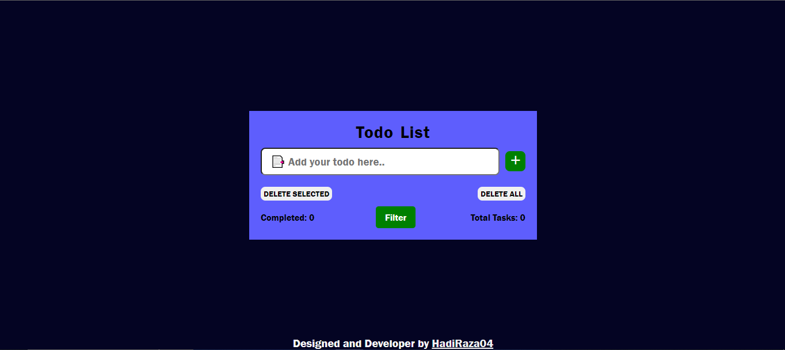

# <a href="https://hadiraza04.github.io/simple-todo/">TODO LIST</a>

## Project Overview

TODO LIST (Made using HTML5 CSS3 and JavaScript)

You can see the website live at: https://hadiraza04.github.io/simple-todo/

ABOUT THIS PROJECT-:

  1. In this project i have created a simple to-do app using HTML CSS and JavaScript.
  2. Built a To-Do List application to make a list of daily works written down in one place.
  3. Implemented functionalities like add task, remove task, filter tasks and also mark tasks as done.

